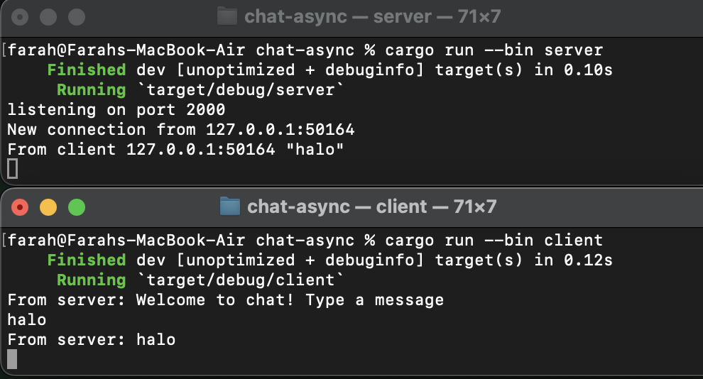
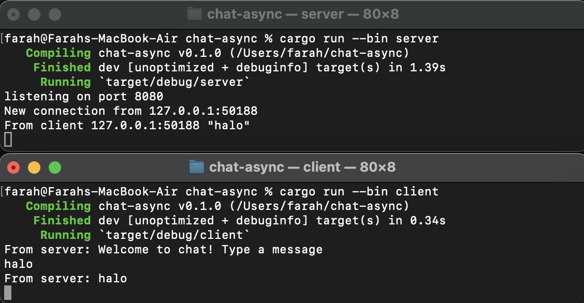

## Reflection
###### 2.1. Original code of broadcast chat.

Setelah menjalankan cargo run --bin server dan setiap klien dijalankan dengan  cargo run --bin client, terlihat bahwa setiap client dan juga server menerima chat broadcast dari semua client. Setiap kali seorang client mengetikkan pesan di command line, pesan tersebut akan dikirim ke server dan server akan meneruskannya ke semua client yang terhubung.

###### 2.2. Modifying the websocket port

Ketika client dan server menggunakan port yang sama, aplikasi berjalan lancar seperti sebelumnya. Namun, jika kita mengubah salah satu port, misalnya port client saya ubah menjadi 2000 dan port server tetap 8080, akan terjadi kesalahan. Saat saya menjalankan cargo run --bin client, akan terjadi error karena port pada client tidak memiliki connection.